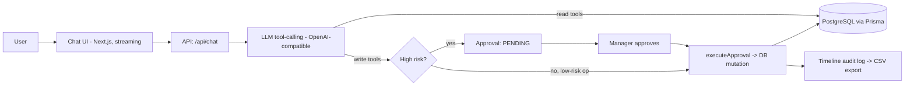

# OpsPilot — an AI operations assistant for e-commerce, with guardrails

OpsPilot lets an online store's operations team get things done just by chatting. You can ask it what's going on ("why are shipments delayed?") and tell it what to do ("refund this order", "add these products") in plain English — but anything risky stops for a human to approve before it actually happens, and every action is logged so you can see who did what and why.

**▶ Live demo:** https://ops-pilot-gqt1ju1go-one-piece-3.vercel.app/

> Tip: in the sidebar, click **⚡ Generate Store Data** to populate the demo, set your role to **Manager**, then open a **New Chat** for the briefing.

---

## Problem statement

Running an online store means constantly switching between tools to handle refunds, stock, discounts, shipments, and support — and a single slip (an over-large refund, a 50%-off code, a bad bulk stock edit) is expensive and hard to trace back. Most dashboards only let you *look*, and most "AI assistants" either make things up or act with no controls at all. OpsPilot sits in the middle: it reads your real store data, suggests what to do, and puts every risky change behind a quick risk check, a manager's approval, and an audit log.

## Users & context

OpsPilot is built for the person running day-to-day store operations — typically an **operations or store manager** at a small or mid-sized online retailer. Support leads and operators use it too, but with a lighter touch: they can dig into the data and *request* actions, while only a manager can sign off on the risky ones.

The work it's meant for is the everyday stuff: figuring out why orders are late, spotting which products keep getting returned, issuing a refund, spinning up a promo code, adding new products, or restocking what's running low. People want this to be fast — but when money or inventory is on the line, they also need to know it was checked and approved, not just fired off.

## Solution overview

At its heart OpsPilot is a chat assistant that can actually *do* things, with a safety gate in front of the risky ones.

It runs in two modes: **Ask** (read-only — just answer questions) and **Agent** (can take action). When you type a request, the language model figures out what you mean and calls the right tool — pulling live data for questions, or carrying out an action when you ask for one. It understands phrasing like "today" or "this week" on its own, so there are no rigid commands to memorize.

The important part is what happens with risky actions. Refunds, discounts over 20%, and inventory or product changes don't just execute — they create a **pending approval** that only a manager can release. Everyday low-risk things (cancelling an order, resolving a ticket) go through directly. Once a manager approves, OpsPilot performs the real database change and records it on a timeline you can export, so there's always a paper trail.

A few touches make it feel less like a tool and more like a teammate: it greets you with a short briefing of what needs attention, you can switch between a Manager and Operator view to see the governance in action, and you can drop in a messy supplier CSV and watch it map the columns and clean up the values automatically.



## Setup & run

You'll need Node.js 20+, a PostgreSQL database, and an API key for an OpenAI-compatible chat model.

```bash
# 1. Install
git clone https://github.com/MuthuM3/OpsPilot.git && cd OpsPilot
npm install

# 2. Create a .env file with these values:
#    DATABASE_URL          your PostgreSQL connection string
#    OPENAI_API_KEY        key for your LLM provider
#    OPENAI_API_BASE_URL   (optional) a custom OpenAI-compatible endpoint
#    OPENAI_MODEL_NAME     e.g. gpt-4o-mini

# 3. Set up the database
npx prisma generate
npx prisma db push

# 4. Start it
npm run dev            # http://localhost:3000
```

Once it's running, click **⚡ Generate Store Data** in the sidebar to fill the store with sample products, customers, orders, refunds, and a few pending approvals. It's safe to click again any time — it resets the demo data to a clean state.

A good way to walk through it:

1. Set your role to **Manager** (sidebar → *Acting as*) and open a **New Chat** — you'll get a short briefing of what needs attention.
2. Ask *"Which shipments are delayed?"*, then *"Why are shipments delayed?"*
3. Try *"Add 3 new demo products"*, approve it, and watch them appear in Inventory Control.
4. Try *"Refund order ORD-1024"* — review why it was flagged, approve it, then check the Audit Logs.
5. Switch to **Operator** and try *"approve it"* — you'll be blocked, with a one-click chip to switch back to Manager.
6. In Inventory Control, hit **Download Sample Messy CSV**, upload it back, and watch the AI tidy up the columns and values.

If you don't set an LLM key (or the endpoint is unreachable), OpsPilot quietly falls back to a built-in offline engine so the app still works.

## Models & data

OpsPilot works with any **OpenAI-compatible chat model** — it defaults to `gpt-4o-mini` but you can point it anywhere using the `OPENAI_*` environment variables. It uses streaming responses and function (tool) calling. Whatever model you choose, you're bound by that provider's terms of use. If there's no key configured at all, it falls back to a simple rule-based engine that runs entirely offline.

All the data in OpsPilot is **made up for the demo** — the products, customers, orders, refunds, and tickets are generated in the app, so there's no real customer information or PII anywhere. The Shopify, Stripe, and Zendesk connections are **simulated** (and labeled as such in the UI) — nothing reaches a live service, and no real money or fulfillment is involved.

On licensing: the application code is yours to license as you see fit (_add your license here_ — e.g. MIT or proprietary); the sample data is generated by the project itself, so there are no third-party strings attached; and the libraries it builds on (Next.js, Prisma, TanStack Query, Recharts, lucide-react, the OpenAI SDK) are used under their own open-source licenses.

## Evaluation & guardrails

The biggest risk with an AI that can take action is that it either makes something up or does something it shouldn't. OpsPilot is designed around both.

To keep it honest, the assistant answers from live database lookups rather than from memory, and its analytics are calculated from real records. It's explicitly instructed never to invent data or claim it did something without actually calling the matching tool — so you won't get a cheerful "done!" while nothing changed. The actual changes happen in server code, not in the model's text.

To keep it safe, the genuinely risky actions — refunds, big discounts, inventory and product changes — never run on their own; a manager has to approve them. That manager-only rule is enforced on the server, not just hidden in the UI, so an operator can't slip past it. Refunds get a risk score (based on things like amount and how often a customer has refunded) with a plain-English reason attached. Approving the same thing twice does nothing, and every execution lands in an exportable audit log.

A couple of smaller things help too: the data is synthetic so there's no bias or privacy exposure from real customers, currency and locale are kept consistent (INR), and if the model times out or errors, you get a clear message and the offline fallback keeps things moving.

To be straight about it: testing so far has been **manual, hands-on checking** of each flow end to end rather than an automated evaluation suite — that's called out below as something still to build.

## Known limitations & risks

There's no real login or identity yet — the Manager/Operator switch is a convincing way to *show* governance, but it isn't production authentication, so don't ship it as-is. The integrations are simulated, so nothing actually talks to Shopify, Stripe, or Zendesk. Because there's a language model in the loop, behavior varies a little run to run — sometimes it'll ask you to confirm instead of acting straight away — and how fast it feels depends on your model endpoint (multi-step requests can take a few seconds). It's also single-tenant, has no rate limiting, and doesn't have an automated test suite yet. A few analytics (like attributing delays to a specific carrier or warehouse) aren't backed by the data model, so the assistant says so rather than guessing. And the demo data is disposable — "Generate Store Data" wipes and rebuilds it.

## Team

| Name | Role | Contact |
|------|------|---------|
| **Muthu M** | Software Engineer | muthumw303@gmail.com · +91 91104 20460 |
